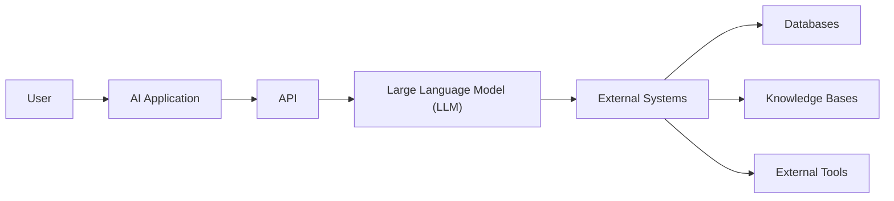
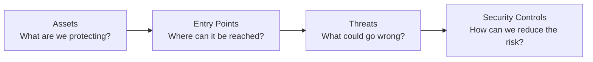
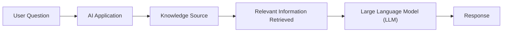

## AI Security

### Foundational Knowledge • Security Principles • Practical Application

AI Security focuses on identifying, assessing, and reducing risks associated
with Artificial Intelligence and Machine Learning systems. This learning path
introduces the foundations of AI Security and gradually progresses into
Large Language Model (LLM) security, threat modelling, prompt injection,
AI supply chain security, data poisoning, Retrieval-Augmented Generation (RAG)
security, and AI risk management.

The objective is not only to understand AI-related vulnerabilities, but also
to develop the ability to recognize security risks, investigate them in
authorized environments, and recommend appropriate security controls.

### Learning Objectives

By completing this learning path, you should be able to:

- Explain the basic concepts behind Artificial Intelligence and Machine Learning
- Identify the main components of an AI-enabled system
- Identify common AI attack surfaces
- Understand common security risks affecting AI and LLM applications
- Explain prompt injection and jailbreaking
- Perform basic AI threat modelling
- Understand security risks associated with AI models and data
- Identify AI supply chain risks
- Explain data poisoning and its possible impact
- Understand Retrieval-Augmented Generation (RAG) and its security risks
- Identify possible sensitive information exposure in AI applications
- Understand basic defensive approaches for AI systems
- Use recognized AI Security frameworks and resources
- Apply AI Security concepts in controlled and authorized environments

### Recommended Prerequisites

Before beginning this learning path, it is recommended that you have:

- Basic cybersecurity knowledge
- Basic networking knowledge
- Basic understanding of web applications and APIs
- Basic programming knowledge
- General familiarity with Artificial Intelligence

### Learning Path

```mermaid
flowchart LR
    A["1. AI & ML<br/>Fundamentals"] --> B["2. AI Security<br/>Fundamentals"]
    B --> C["3. LLM<br/>Security"]
    C --> D["4. AI Threat<br/>Modelling"]
    D --> E["5. Prompt<br/>Security"]
    E --> F["6. Defensive<br/>AI Security"]
    F --> G["7. AI Supply Chain<br/>Security"]
    G --> H["8. RAG & Data<br/>Security"]
    H --> I["9. AI Risk<br/>Management"]
    I --> J["10. Practical AI<br/>Security Assessment"]
```

### Stage 1: AI and Machine Learning Fundamentals

Before learning how to secure an AI system, it is important to understand the main components and concepts that make up these systems.

| **Concept** | **What You Need to Understand** | **Why It Matters in AI Security** |
|---|---|---|
| **Artificial Intelligence (AI)** | Computer systems designed to perform tasks that normally require some form of human intelligence. | Understanding the system's purpose makes it easier to identify what needs to be protected. |
| **Machine Learning (ML)** | A branch of AI where systems learn patterns from data to make predictions or produce outputs. | ML systems depend on models and data, both of which can introduce security risks. |
| **Deep Learning** | A specialised area of Machine Learning that uses multi-layer neural networks. | Many modern AI systems, including Large Language Models, are based on deep learning. |
| **AI Models** | Models process input and produce predictions, classifications, or responses based on learned patterns. | The model itself can be a valuable asset and may become a target for manipulation or misuse. |
| **Training Data** | Data used during the process of training an AI model. | Manipulated, exposed, or untrusted training data can affect the security and reliability of the model. |
| **Generative AI** | AI systems capable of generating new content such as text, images, audio, video, or code. | Generative AI introduces security considerations involving prompts, outputs, data, and connected systems. |
| **Large Language Models (LLMs)** | AI models designed to process, understand, and generate human language. | LLM applications introduce security concerns such as prompt injection and sensitive information exposure. |

### Hands-on Resource : TryHackMe

The TryHackMe AI Security learning path provides practical training covering
AI fundamentals and several AI Security topics through controlled laboratory
environments.

https://tryhackme.com/path/outline/aisecurity

### Stage 2: AI Security Fundamentals

#### 2.1 Understanding AI Security

AI Security focuses on protecting AI-enabled systems, models, data, users,
and connected infrastructure against security threats. Traditional cybersecurity remains important because AI applications may still
depend on:

- User accounts
- Authentication
- APIs
- Databases
- Networks
- Cloud services
- Access controls
- Software dependencies

However, AI systems may introduce additional areas requiring protection,
including:

- AI models
- Training and fine-tuning data
- System prompts
- User prompts
- Model outputs
- Embeddings
- Vector databases
- AI agents
- External tools
- Knowledge sources

### 2.2 The AI Attack Surface

An attack surface includes the different points through which a system could
potentially be targeted or manipulated.

For an AI-enabled application, the attack surface may include:

- User input
- AI models
- APIs
- Uploaded files
- Training data
- Knowledge bases
- Model outputs
- Third-party models
- External tools
- Plugins and extensions
- Authentication systems

### Security Analysis Questions

When assessing an AI-enabled application, consider:

1. What information can the AI access?
2. What information can the user control?
3. Where does the AI obtain its information?
4. What external systems can the AI communicate with?
5. What actions can the AI perform?
6. What permissions have been assigned to the AI?
7. What sensitive information could potentially be exposed?
8. What would happen if the AI received malicious or misleading input?

## Stage 3: Large Language Model Security

### 3.1 Understanding LLM Applications

Large Language Models can be integrated into:

- Chatbots
- Search systems
- Customer support applications
- Coding assistants
- Document analysis systems
- Business automation
- Security applications
- AI agents

An LLM is usually one part of a larger application. Its structure may look like this:

External systems could include:

- Databases
- Documents
- APIs
- Email systems
- Search services
- Business applications
- External tools

### 3.2 Common LLM Security Risks

Important areas to study include:

- Prompt Injection
- Sensitive Information Disclosure
- Supply Chain risks
- Data and Model Poisoning
- Improper Output Handling
- Excessive Agency
- System Prompt Leakage
- Vector and Embedding Weaknesses
- Misinformation
- Unbounded Consumption

When studying each vulnerability, consider :

1. What is the vulnerability?
2. How could it affect an AI application?
3. What would the security impact be?
4. What controls could reduce the risk?

### Essential Resources  

#### 1. OWASP GenAI Security Project

The OWASP GenAI Security Project provides security guidance and resources for
Generative AI and LLM-powered applications.

https://genai.owasp.org/

#### 2. OWASP Top 10 for LLM and Generative AI Applications

https://genai.owasp.org/llm-top-10/

## Stage 4: AI Threat Modelling

### 4.1 Understanding Threat Modelling

Threat modelling is the process of examining a system to identify possible
security threats before they become incidents.

A basic AI threat assessment should consider:

| **Area** | **Question to Ask** | **What to Consider** |
|---|---|---|
| **Assets** | **What needs to be protected?** | AI models, training data, customer information, API keys, system prompts, source code, and knowledge bases |
| **Entry Points** | **Where can the system be accessed or influenced?** | Prompts, APIs, uploaded documents, external websites, plugins, and knowledge sources |
| **Threats** | **What could go wrong?** | Information disclosure, unauthorised access, manipulation of AI behaviour, data poisoning, compromised dependencies, and service disruption |
| **Security Controls** | **What can reduce the risk?** | Authentication, authorisation, least privilege, input and output validation, monitoring, human approval, and secure data handling |

#### Threat Modelling in Practice

### Threat Intelligence Resource : MITRE ATLAS

Use MITRE ATLAS to explore techniques associated with attacks against
AI-enabled systems.

https://atlas.mitre.org/

### Stage 5: Prompt Injection and Jailbreaking

### 5.1 Prompt Injection

Prompt injection occurs when input provided to an LLM influences the model in
an unintended way.

The risk can become more serious when an AI application is connected to:

- Sensitive information
- External tools
- Databases
- Email
- Files
- Business applications

There are two types of Prompt Injection, namely : 

- **Direct Prompt Injection :**  Direct prompt injection occurs when a user directly provides instructions
intended to influence the behaviour of the model.

- **Indirect Prompt Injection :** Indirect prompt injection may occur when malicious instructions exist within
external content processed by the AI system.

**Jailbreaking**

Jailbreaking generally involves attempts to bypass restrictions or safeguards
placed on an AI system.

**NB** : Although jailbreaking and prompt injection are related, they should not be
treated as identical concepts.

### OWASP — Prompt Injection

https://genai.owasp.org/llmrisk/llm01-prompt-injection/

### TryHackMe — Prompt Security

The TryHackMe AI Security learning path provides controlled exercises covering
prompt injection, jailbreaking, and prompt defence.

https://tryhackme.com/path/outline/aisecurity

### Stage 6: Defensive AI Security

Identifying a vulnerability is only part of security analysis. A security professional should also understand how the identified risk could
be reduced.
 
Defensive measures may include:

- Least privilege
- Strong authentication
- Appropriate authorisation
- Input validation
- Output validation
- Limiting access to external tools
- Protecting sensitive information
- Separating trusted and untrusted content
- Logging and monitoring
- Security testing
- Human approval for high-impact actions

AI Security should use multiple layers of protection rather than relying on a
single security control.

### Stage 7: AI Supply Chain Security

AI applications frequently depend on components developed by other
organizations or individuals. A weakness or compromise within one of these components could affect the
security of the entire application.

These may include:

- Third-party AI models
- Open-source models
- External datasets
- AI frameworks
- Software libraries
- APIs
- Plugins
- Model repositories

### Supply Chain Assessment Questions

Before using an external AI component, consider:

- Where did the component originate?
- Who developed it?
- Can the source be trusted?
- Has its integrity been verified?
- What permissions does it require?
- Is it actively maintained?
- Does it contain known vulnerabilities?
- How will updates be managed?

### Hands-on Resource

### TryHackMe — AI Supply Chain Security

The AI Security learning path includes material covering AI supply chain
structure, possible attack vectors, and defensive approaches.

https://tryhackme.com/path/outline/aisecurity

### OWASP GenAI Security

https://genai.owasp.org/llm-top-10/

### Stage 8: Data Poisoning and RAG Security

### 8.1 Data and Model Poisoning

AI systems depend heavily on data. Data poisoning occurs when data used by an AI system is intentionally
manipulated in a way that affects the behaviour, reliability, or security of
the system.

Possible targets include:

- Training data
- Fine-tuning data
- Embeddings
- Knowledge bases
- RAG documents

Possible consequences include:

- Incorrect outputs
- Manipulated behaviour
- Reduced reliability
- Hidden weaknesses
- Security backdoors

### OWASP — Data and Model Poisoning

https://genai.owasp.org/llmrisk/llm042025-data-and-model-poisoning/

### 8.2 Retrieval-Augmented Generation

Retrieval-Augmented Generation (RAG) allows an AI application to retrieve
information from an external source before generating its response.

A simplified process may look like:

RAG can improve the usefulness of AI applications, but it can also introduce
additional security concerns.

### RAG Security Considerations

Consider:

- Who can add information to the knowledge source?
- Who can modify it?
- Is retrieved information automatically trusted?
- Can sensitive information be retrieved?
- Are user permissions checked before retrieval?
- Could malicious instructions enter through stored documents?
- Could poisoned information influence the model's response?

### Hands-on Practice on TryHackMe

https://tryhackme.com/path/outline/aisecurity

### Stage 9: AI Risk Management

AI Security extends beyond individual vulnerabilities. Organisations also need structured processes for identifying, assessing,
prioritising, and managing AI risks.

### NIST AI Risk Management Framework

The NIST AI Risk Management Framework provides a structured approach for
managing risks associated with AI systems.

Its four main functions are:

| **Function** | **Purpose** |
|---|---|
| **GOVERN** | Establish policies, responsibilities, and processes for managing AI risk. |
| **MAP** | Understand the AI system, its context, users, and possible risks. |
| **MEASURE** | Analyse, test, and evaluate identified risks. |
| **MANAGE** | Prioritise identified risks and determine how they should be addressed. |

### Resources

#### Video Learning Resources

1. **Artificial Intelligence and Machine Learning Fundamentals**
   - **IBM Technology — AI, Machine Learning, Deep Learning and Generative AI Explained**
   - https://www.youtube.com/watch?v=qYNweeDHiyU
   - Covers AI, Machine Learning, Deep Learning, foundation models, Generative AI and LLMs.

2. **Introduction to AI Security**
   - **IBM Technology — Securing AI Systems: Protecting Data, Models, & Usage**
   - https://www.youtube.com/watch?v=2A94Mxn3jAc
   - Introduces AI Security from the perspective of protecting AI data, models and their usage.

3. **AI Security and Generative AI Risks**
   - **IBM Technology — How to Secure AI Business Models**
   - https://www.youtube.com/watch?v=pR7FfNWjEe8
   - Introduces security, privacy and risk considerations surrounding Generative AI.

4. **OWASP and LLM Security**
   - **IBM Technology — How to Protect AI from OWASP Top 10 Threats**
   - https://www.youtube.com/watch?v=gUNXZMcd2jU
   - Explores important OWASP LLM security risks, including prompt injection and data exposure.

5. **LLM Security and Defence**
   - **IBM Technology — LLM Hacking Defense: Strategies for Secure AI**
   - https://www.youtube.com/watch?v=y8iDGA4Y650
   - Covers LLM security risks including prompt injection, jailbreaking, data leakage, and defence-in-depth strategies.

6. **Prompt Injection**
   - **IBM Technology — Securing AI Agents: How to Prevent Hidden Prompt Injection Attacks**
   - https://www.youtube.com/watch?v=5ZA1lTxTH3c
   - Demonstrates how indirect prompt injection can affect AI agents and explores practical approaches for protecting AI systems.

7. **NIST AI Risk Management Framework**
   - **Safeshield Training — The NIST Artificial Intelligence Risk Management Framework (NIST AI RMF)**
   - https://www.youtube.com/watch?v=rbFt34UmngY
   - Covers the structure and practical purpose of the NIST AI Risk Management Framework.

### Websites

#### 1. TryHackMe — AI Security Learning Path

**Purpose:** Hands-on AI Security training and practical laboratory exercises.

https://tryhackme.com/path/outline/aisecurity

#### 2. OWASP GenAI Security Project

**Purpose:** Generative AI and LLM application security guidance.

https://genai.owasp.org/

#### 3. OWASP Top 10 for LLM and Generative AI Applications

**Purpose:** Reference for important security risks affecting LLM and
Generative AI applications.

https://genai.owasp.org/llm-top-10/

#### 4. MITRE ATLAS

**Purpose:** Knowledge base of adversary tactics and techniques involving
AI-enabled systems.

https://atlas.mitre.org/

#### 5. NIST AI Risk Management Framework

**Purpose:** Structured AI risk management guidance.

https://www.nist.gov/itl/ai-risk-management-framework

#### 6. NIST AI Resource Center

**Purpose:** Additional AI risk management, testing, evaluation, and technical
resources.

https://airc.nist.gov/

#### Competence check

Before moving to AI Security Level 1, make sure you can confidently :

- [ ] Explain how AI, Machine Learning and Deep Learning relate to each other
- [ ] Identify the main components and assets of an AI-enabled system
- [ ] Identify possible AI attack surfaces
- [ ] Explain common LLM security risks
- [ ] Explain prompt injection, indirect prompt injection and jailbreaking
- [ ] Perform a basic AI threat assessment
- [ ] Apply the principle of least privilege to an AI system
- [ ] Identify AI supply chain risks
- [ ] Explain data poisoning and its possible impact
- [ ] Explain how RAG works and identify basic RAG security risks
- [ ] Recognise possible sensitive information exposure
- [ ] Recommend suitable security controls for identified risks
- [ ] Use OWASP GenAI Security, MITRE ATLAS and NIST AI RMF as security references
- [ ] Apply these concepts in an authorised practical environment

### Put Your Knowledge to the Test

Before moving on, choose any AI-enabled application and try to answer these
questions without referring back to the learning material:

1. What are the most important assets in the system?
2. Where are its main entry points?
3. What AI-specific security risks can you identify?
4. Which risk would you consider the most important, and why?
5. What security controls would you recommend?

If you can analyse the system and support your decisions using the resources
covered in this learning path, you are ready to progress to AI Security Level 1.

