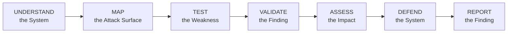
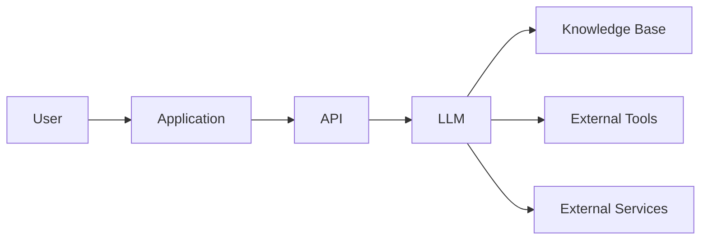
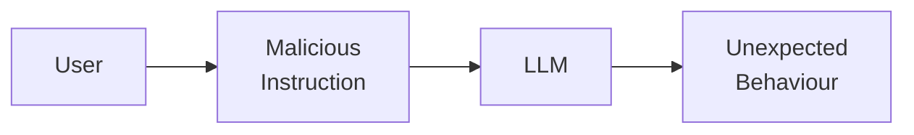
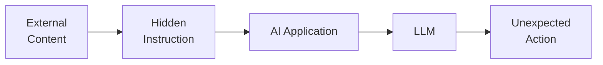
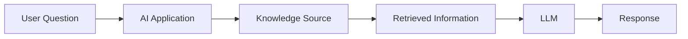
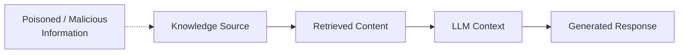
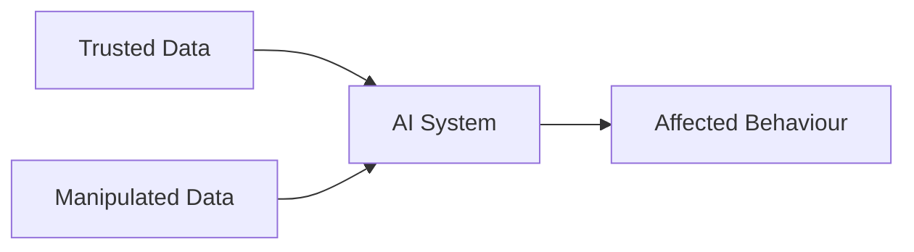
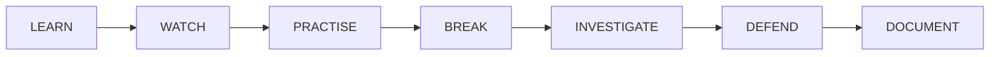
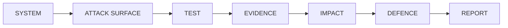

## AI Security Level 1 (AI1)

**Practical AI Security • Hands-On Investigation • Certification Preparation**

AI Security Level 1 is where AI Security moves from understanding concepts to applying them. The previous AI Security level introduced the foundations: AI systems, attack surfaces, LLM security, prompt injection, threat modelling, AI supply chains, RAG, data poisoning, and risk management. At Level 1, those foundations become practical skills. The objective is no longer simply understanding the vulnerabilities but to recognise, investigate, and recommend appropriate defences against them.

### The AI1 Journey

A successful test is not the end of an AI Security investigation. You should also be able to determine:

- What happened?
- Why did it happen?
- Which component was affected?
- What evidence supports the finding?
- What could an attacker achieve?
- How serious is the risk?
- Which control would reduce the risk?
- How should the finding be communicated?
  
### AI1 Core Skills

AI1 focuses heavily on four practical areas:

| **Skill Area** | **Practical Goal** |
|---|---|
| **AI Threat Modelling** | Analyse an AI architecture and identify realistic attack paths |
| **Prompt Injection & Jailbreaking** | Investigate how malicious instructions can manipulate AI behaviour |
| **AI Supply Chain Security** | Determine whether models and AI components can be trusted |
| **RAG & Data Poisoning Security** | Investigate how untrusted or manipulated data can influence AI systems |

## 1. AI Threat Modelling

### From Diagram to Investigation

At foundation level, you learned about assets, threats, entry points, attack surfaces, and security controls. At Level 1, you should be able to look at an unfamiliar AI system and identify these yourself.

An AI-enabled application might contain:

Your job is to investigate the relationships between these components.

### Questions to Ask

When analysing the architecture, ask:

1. What information needs protection?
2. Where can users interact with the system?
3. Where does untrusted information enter?
4. Which components communicate with each other?
5. Where are the trust boundaries?
6. What privileges does the AI have?
7. Which external systems can it access?
8. What could happen if one component were manipulated?
9. Which attack path presents the greatest risk?
10. What security control would reduce that risk?

## Practical Resource

### TryHackMe — Secure AI Systems

https://tryhackme.com/module/secure-ai-systems

Focus on:

- Securing AI Systems
- LLM Security
- AI Threat Modelling
- AI System Reconnaissance
- AI Threat Modelling Assessment

## 2. Prompt Injection & Jailbreaking

You should already understand the basic idea behind prompt injection. Level 1 takes this further.

### Direct Prompt Injection

A malicious instruction is provided directly to the AI.

### Indirect Prompt Injection

The malicious instruction comes from information processed by the AI rather than directly from the user.

Examples of external content could include:

- Documents
- Emails
- Websites
- Knowledge bases
- Retrieved information

## What to Investigate

When testing an authorised environment, ask:

- What instructions should the AI follow?
- Which instructions are trusted?
- Which input is controlled by the user?
- Can external information influence AI behaviour?
- Can system instructions be exposed?
- Can safeguards be bypassed?
- Can the AI perform an action the user should not control?
- What is the security impact?
- What defence could prevent or limit the behaviour?

## Video Resource

### IBM Technology — AI Model Penetration: Testing LLMs for Prompt Injection & Jailbreaks

https://www.youtube.com/watch?v=xOQW_qMZdlc

**Watch for :**

- Prompt injection
- Jailbreaking
- AI penetration testing
- Poisoned information
- Red teaming
- Defensive testing

## 3. AI Supply Chain Security

AI applications are rarely built entirely from components created by one organisation.

They may depend on:

- Pre-trained models
- Open-source libraries
- Training datasets
- Model repositories
- Frameworks
- APIs
- Plugins
- Third-party services
- External dependencies

Each dependency introduces trust.That means an important Level 1 question is whether you can trust the components that a particular AI system depends on.

### Investigating Model Provenance

Before trusting a model, investigate:

| **Question** | **What You Are Establishing** |
|---|---|
| Where did the model come from? | Origin |
| Who published it? | Ownership |
| Is the source legitimate? | Trust |
| Has the model been modified? | Integrity |
| What dependencies does it require? | Supply-chain exposure |
| Is documentation available? | Transparency |
| Does it behave as expected? | Behavioural trust |

### Static vs Behavioural Investigation

| **Static Investigation** | **Behavioural Investigation** |
|---|---|
| Examine model files | Run controlled tests |
| Review metadata | Observe responses |
| Inspect configuration | Compare expected and actual behaviour |
| Examine dependencies | Search for unusual triggers |
| Look for suspicious artefacts | Investigate unexpected behaviour |
| Establish provenance | Determine whether behaviour changes under certain conditions |

The goal is not simply to find something unusual and to collect enough evidence to decide whether the component should be trusted.

## 4. RAG Security

Retrieval-Augmented Generation introduces another security challenge because the LLM is no longer working only with its original knowledge. It retrieves information from another source.

Now consider what happens if the knowledge source cannot be trusted.

### Investigating a RAG System

Ask:

- Who can add information to the knowledge source?
- Who can modify existing information?
- Can users upload documents?
- Can malicious instructions exist inside those documents?
- Does the AI automatically trust retrieved information?
- Does retrieval respect user permissions?
- Could one user retrieve another user's information?
- Could sensitive information enter the LLM context?
- Are generated responses validated?
- Is retrieved information logged?

## 5. Data Poisoning

Data poisoning attacks the information that an AI system learns from or retrieves. Instead of directly attacking the final AI response, an attacker may attempt to influence the information used to produce that response.

Conceptually:

### Investigate

- Where did the data originate?
- Who can modify it?
- Is its integrity checked?
- Could malicious information have been inserted?
- Which AI components use the information?
- How would manipulated data affect the system?
- Can the poisoned information be identified and removed?

## 6. Moving From Attack to Defence

AI1 is not only about making an AI system behave incorrectly. You should also understand how the weakness can be reduced.

| **Security Problem** | **Defensive Direction** |
|---|---|
| AI has unnecessary tool permissions | Apply least privilege |
| External content can manipulate AI instructions | Treat external content as untrusted |
| Sensitive information is retrieved by unauthorised users | Enforce authorisation during retrieval |
| Model origin cannot be verified | Establish and verify model provenance |
| Knowledge source can be freely modified | Strengthen data integrity and access controls |
| Dangerous AI actions execute automatically | Introduce approval controls for high-impact actions |
| Suspicious AI activity cannot be investigated | Improve logging and monitoring |

## 7. Evidence Matters

Finding unusual behaviour does not automatically mean that you have discovered a vulnerability.

A Level 1 investigation should distinguish between:

**-Observation** :What did you actually see?

**-Evidence** : What information supports your observation?

**-Interpretation** : Why do you believe the behaviour represents a security concern?

**-Impact** : What could happen if the weakness were exploited?

**-Recommendation** : What should change?

## AI Security Finding Template

| **Finding Area** | **Your Investigation** |
|---|---|
| **Finding Title** | |
| **Affected Component** | |
| **Observation** | |
| **Evidence** | |
| **Attack Method** | |
| **Potential Impact** | |
| **Risk Level** | |
| **Recommended Defence** | |

## 8. AI1 Practical Training

### TryHackMe — AI Security Learning Path

https://tryhackme.com/path/outline/aisecurity

This is the main practical preparation path for AI1.

It includes five major areas:

### AI Fundamentals
Build the knowledge required to understand AI systems and their security implications.

### Secure AI Systems
Learn AI architecture security, LLM security, threat modelling, and reconnaissance.

### Prompt Security
Practise prompt injection, jailbreaking, and prompt defence.

### AI Supply Chain Security
Investigate AI dependencies, models, supply-chain attacks, and model security.

### Data Poisoning
Investigate RAG security, poisoned information, and sensitive information disclosure.

## 9. AI1 Certification Preparation

The learning path builds the skill.

**AI1 tests whether you can apply it.**

AI1 uses practical scenarios where you are expected to work with AI systems rather than only answer theoretical questions.

## Official AI1 Training Content

https://help.tryhackme.com/en/articles/15300494-ai1-training-content

Use this before attempting the certification to identify the areas that require the most practice.

## Official AI1 Exam Guide

https://help.tryhackme.com/en/articles/15301082-ai1-exam-guide

Review the official guide before attempting AI1 so that you understand the assessment environment and requirements.

## TryHackMe AI Security & AI1

https://tryhackme.com/aisecurity

Use this page to explore the relationship between the AI Security training path and the AI1 professional certification.

## 10. Video Learning

### AI Model Penetration Testing

**IBM Technology — AI Model Penetration: Testing LLMs for Prompt Injection & Jailbreaks**

https://www.youtube.com/watch?v=xOQW_qMZdlc

### Focus

- Prompt injection
- Jailbreaking
- Poisoned data
- AI red teaming
- LLM penetration testing
- Defensive testing

## How to Study at Level 1

Avoid :

**Watch → Read → Watch → Read → Memorise**

Instead use:

For every topic:

### 1. Learn
Understand the concept.

### 2. Watch
Observe how the technique works.

### 3. Practise
Use an authorised lab.

### 4. Investigate
Determine why the behaviour occurred.

### 5. Defend
Identify an appropriate security control.

### 6. Document
Record what you discovered and why it matters.

## AI1 Readiness Check

Before attempting AI1, challenge yourself.

Can you:

- [ ] Analyse an unfamiliar AI architecture?
- [ ] Identify its important assets?
- [ ] Identify trust boundaries?
- [ ] Map its attack surface?
- [ ] Build a practical threat model?
- [ ] Recognise direct prompt injection?
- [ ] Recognise indirect prompt injection?
- [ ] Investigate jailbreaking?
- [ ] Explain the security impact rather than only demonstrate the attack?
- [ ] Investigate model provenance?
- [ ] Examine AI supply-chain risks?
- [ ] Analyse a RAG pipeline?
- [ ] Identify possible data poisoning?
- [ ] Recognise sensitive information exposure?
- [ ] Collect evidence for a security finding?
- [ ] Recommend a defence appropriate to the weakness?
- [ ] Explain your investigation clearly?

If several answers are **No**, that is not failure. Those answers tell you exactly what to practice next.

## Final Practical Challenge

Before attempting AI1, choose an authorised AI Security lab that you have not completed before.

Try to work through:

Ask yourself:

**Can I understand the system without being told where the vulnerability is?**

**Can I identify what should be tested?**

**Can I explain why the behaviour represents a security risk?**

**Can I support my conclusion with evidence?**

**Can I recommend an appropriate defence?**

If you can do those things consistently, you are no longer only learning the terminology of AI Security. You are beginning to investigate AI systems like a security practitioner.

**Do not aim to memorise every AI attack. Aim to understand AI systems well enough to recognise when something is wrong, investigate why it happened, and determine what should be done about it.**
